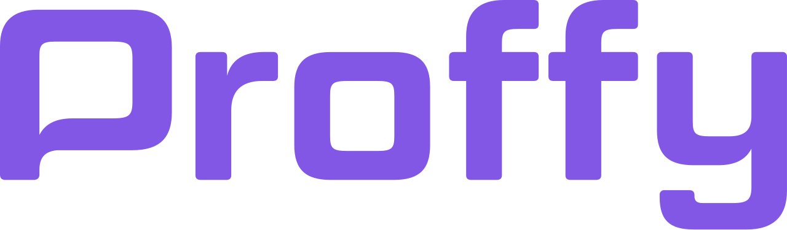
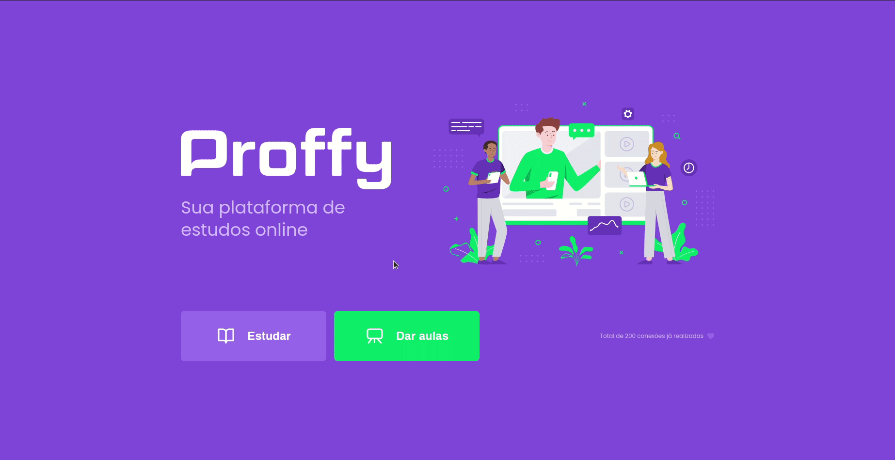
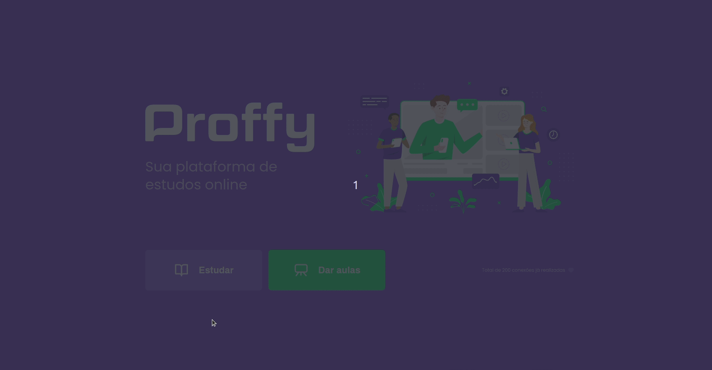

<h1 align="center">
      
    HTML | CSS | JavaScript
</h1>

 

  <a href="#question-about">About</a>&nbsp;&nbsp;&nbsp;|&nbsp;&nbsp;&nbsp;
  <a href="#gear-technologies">Technologies</a>&nbsp;&nbsp;&nbsp;|&nbsp;&nbsp;&nbsp;
  <a href="#rocket-getting-started">Getting Started</a>&nbsp;&nbsp;&nbsp;|&nbsp;&nbsp;&nbsp;
  <a href="#memo-license">License</a>

    An App to connect teachers to students

### Register a class:

### Filter a class

---

  

## :question: About

This app was built during the "Next Level Week | RocketSeat "

## :gear: Technologies
🌐 <strong>HTML, JavaScript, CSS</strong>  
⚙️ <strong>Node Js</strong> —> A platform for building network applications  
✏️ <strong>Nunjucks</strong> —> Templating language for JavaScript  
📈 <strong>Sqlite</strong> —> C-language library that implements a SQL database engine  

## :rocket: Getting Started
1. Clone this repo: `git clone https://github.com/erickivel/proffydiscovery.git`
2. Move to the directory: `cd proffydiscovery`
3. Run `npm install` to install the dependencies
4. Run `npm run dev` to start the server
5. Open `http://localhost:5500` in your browser

## :memo: License

This project is licensed under the **MIT License** - see the [LICENSE](LICENSE) file for details.
